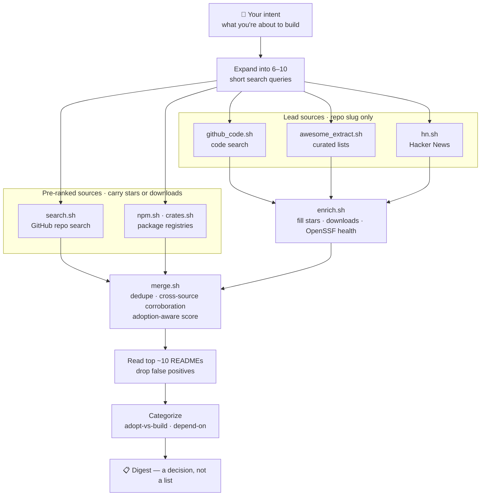

# gh-scout


**Stop rebuilding things that already exist.** Point gh-scout at your idea before Claude Code writes a line of it, and it tells you: adopt this, depend on that, or here's why nothing exists and you should build it.

You know that sinking feeling three hours into a build, when you discover a maintained library already does this? gh-scout gives you that feeling *before* you start, not after — by expanding your idea into a dozen search angles across GitHub, npm/crates, awesome-lists, and Hacker News, scoring every result by real signals (cross-source corroboration, download counts, maintenance health), and reading the top candidates' READMEs itself.

## Install

```bash
git clone https://github.com/kosmoperion/gh-scout.git ~/.claude/skills/gh-scout
```

Claude Code picks up any skill under `~/.claude/skills/` automatically — no build step, nothing to compile. Requires [`gh`](https://cli.github.com/), authenticated (`gh auth login` — code search specifically requires it), and `jq`. Every other source (npm, crates.io, deps.dev, Hacker News) is a plain, auth-free HTTPS call.

## Usage

Inside Claude Code:

```
/gh-scout help me find repos that do X
```

or just describe what you're about to build in conversation — the skill is written to trigger proactively before implementation plans for new features, libraries, or services. See [`SKILL.md`](SKILL.md) for the exact trigger conditions.

## Example output

A real run against *"software for the maritime shipping/logistics industry"* — the same one shown in the GIF above:

```markdown
## gh-scout: maritime shipping & logistics software — thin ecosystem (primitives exist)

Bottom line: no production-grade OSS for full maritime logistics platforms
(fleet management, port operations, vessel tracking-as-a-product). Pass 1
surfaced only student/portfolio-grade repos — max 2 stars. That mirrors the
real industry: Maersk, MSC, DP World run closed, proprietary logistics
stacks. But pass 2 (searching the underlying protocol — AIS, the standard
ships broadcast position data over) found a mature, real ecosystem.

### 🟢 The real building blocks (adopt, don't rebuild the decoder)
- schwehr/libais — 260★ · C++ · license: none asserted ⚠️
  The reference AIS decoder — de facto standard. No explicit OSS license is
  a real constraint for commercial use.
- ais-dotnet/Ais.Net — 152★ · .NET · AGPL-3.0 ⚠️
  Zero-allocation, millions of sentences/sec. AGPL is a hard constraint if
  you're shipping closed-source.
- BertoldVdb/go-ais — 69★ · Go · MIT
  Implements the actual ITU-R M.1371-5 spec. Clean license — strongest
  adopt candidate of the four.

### Take
Don't expect to adopt a finished maritime logistics platform — that market
is proprietary. If you're building on the vessel-tracking/AIS side, go-ais
(MIT) is the cleanest starting point.
```

Notice what happened there: it didn't just list repos, it caught that the *specific* thing doesn't exist as OSS, pivoted to the *underlying protocol*, and flagged real license constraints (AGPL vs MIT vs unlicensed) that raw star counts would never surface.

## How it works



The ordering matters: **lead sources return only a repo slug, so they're enriched *before* the merge** — otherwise they'd be scored as if they had zero stars and sink to the bottom regardless of how popular the repo actually is. Every source normalizes to one record shape before merging, so no source gets bespoke ranking treatment — see [`docs/IMPLEMENTATION-PART-B.md`](docs/IMPLEMENTATION-PART-B.md) for the full contract.

### Sources

| Source | What it adds | Auth needed |
|---|---|---|
| GitHub repo search | primary discovery, star/recency scored | `gh auth` |
| GitHub code search | finds repos that *use* something without naming it in the README | `gh auth` |
| npm / crates.io | real download counts — a truer adoption signal than stars | none |
| Awesome-lists | human-curated, highest signal-to-noise on GitHub | `gh auth` |
| Hacker News (Algolia) | community traction GitHub's own ranking buries | none |
| deps.dev | OpenSSF health scorecard (opportunistic — often absent) | none |

### Adoption-aware scoring

Stars measure hype and age, not current use. gh-scout's popularity term is:

```
popularity = max(ln(stars + 1), ln(downloads_30d + 1) × 0.5)
```

so a heavily-downloaded package with modest stars still ranks on real usage. (Verified live: `vercel/ms` — 5.5k★, 2.1B downloads/month — scores nearly level with `moment/moment` at 48k★ on popularity alone, before recency correctly discounts `ms` for having no commits since 2020.)

## Design docs

The two implementation guides in [`docs/`](docs/) aren't after-the-fact documentation — they're the actual specs each phase was built against, with every claim about a third-party API verified live before being written down (down to things like *"deps.dev's `dependents` endpoint 404s on every path — dropped from the plan"*).

- [`docs/IMPLEMENTATION-PART-A.md`](docs/IMPLEMENTATION-PART-A.md) — the core GitHub-search scorer: collision guards, quality-signal flags, query-craft rules.
- [`docs/IMPLEMENTATION-PART-B.md`](docs/IMPLEMENTATION-PART-B.md) — the multi-source expansion: normalization contract, every adapter, adoption-aware re-scoring.

## License

MIT — see [`LICENSE`](LICENSE).
